# Stream Deck Plugins for macOS

A collection of 10 custom Stream Deck plugins built with the [Elgato Stream Deck Node.js SDK](https://github.com/elgato/streamdeck) (`@elgato/streamdeck` v1.1). All plugins target macOS and run on Node.js 20.

## Preview

### Keypad Plugins (buttons)

<p>
  
  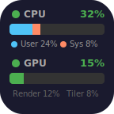
  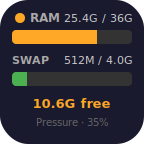
  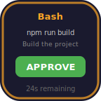
  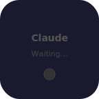
  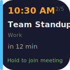
  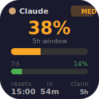
  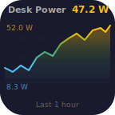
</p>

*Left to right: Bluetooth Connect, CPU Monitor, Memory Monitor, Claude Approve (pending), Claude Approve (idle), Calendar LCD, Claude Usage, HA Sensor Graph*

### Encoder Plugins (Stream Deck+ dials)

<p>
  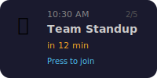
  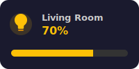
  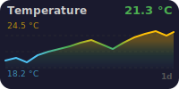
  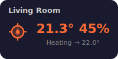
</p>

*Left to right: Calendar Events, MQTT Dimmer, HA Sensor Graph, HA Thermostat*

## Plugins

| Plugin | Controller | Description |
|--------|-----------|-------------|
| **[sd-bt-connect](#sd-bt-connect)** | Keypad | Connect/disconnect Bluetooth devices with battery level and device type icons |
| **[sd-cpu-monitor](#sd-cpu-monitor)** | Keypad | Real-time CPU and GPU usage display |
| **[sd-memory-monitor](#sd-memory-monitor)** | Keypad | RAM, swap, and memory pressure display |
| **[sd-claude-approve](#sd-claude-approve)** | Keypad | Physical approve button for [Claude Code](https://claude.ai/code) permission requests via `PermissionRequest` hook |
| **[sd-calendar-events](#sd-calendar-events)** | Encoder | Browse today's calendar events and join meetings with a dial press |
| **[sd-calendar-lcd](#sd-calendar-lcd)** | Keypad | Today's calendar events on an LCD key with tap-to-cycle and hold-to-join |
| **[sd-claude-usage](#sd-claude-usage)** | Keypad | Real-time Claude rate limit utilization (5h/7d windows) via API |
| **[sd-mqtt-dimmer](#sd-mqtt-dimmer)** | Encoder | Control Zigbee lights via MQTT/Zigbee2MQTT with dial rotation |
| **[sd-ha-graph](#sd-ha-graph)** | Keypad + Encoder | Home Assistant sensor history as line graphs with color-coded values |
| **[sd-ha-thermostat](#sd-ha-thermostat)** | Encoder | Control Home Assistant thermostat via dial with live temperature display |

## Requirements

- **macOS** 10.15 (Catalina) or later
- **Stream Deck** hardware with Stream Deck software 6.4+
  - Keypad plugins: any Stream Deck model
  - Encoder plugins: **Stream Deck+** only (requires dials)
- **Node.js** 20 (used by the Stream Deck runtime)
- **Xcode Command Line Tools** (for building Swift helpers): `xcode-select --install`

## Build & Install

Each plugin is self-contained with its own `package.json`. There is no monorepo workspace.

```bash
# Build and install a single plugin
cd sd-cpu-monitor
npm install
npm run build       # bundles via esbuild, compiles Swift helpers if needed
bash install.sh     # kills Stream Deck, copies plugin, restarts
```

The `install.sh` script copies the built `.sdPlugin` directory to:
```
~/Library/Application Support/com.elgato.StreamDeck/Plugins/
```

## Plugin Details

### sd-bt-connect


Displays Bluetooth device connection status with battery level and device type icons (headphones, keyboard, mouse, etc.). Press the key to toggle connect/disconnect.

**How it works:** Uses `system_profiler SPBluetoothDataType` for device discovery, a custom Swift helper (`bt-info`) with the IOBluetooth framework for battery levels, and [`blueutil`](https://github.com/toy/blueutil) for connect/disconnect.

**Additional dependencies:**
- `blueutil` — install via Homebrew: `brew install blueutil`

**Settings:** Device address (auto-discovered from paired devices), display name, poll interval.

---

### sd-cpu-monitor


Renders a real-time bar chart of CPU usage (user/system/idle) and GPU utilization percentage.

**How it works:** Parses output from `top -l1` for CPU stats and `ioreg -r -c IOAccelerator` for GPU utilization. All tools are built into macOS.

**Additional dependencies:** None.

---

### sd-memory-monitor


Shows used/total RAM, swap usage, and system memory pressure with color-coded status (green/yellow/red).

**How it works:** Uses `vm_stat`, `sysctl`, and `memory_pressure` — all built-in macOS commands.

**Additional dependencies:** None.

---

### sd-claude-approve


A physical button to approve Claude Code permission requests. When Claude Code needs permission to run a tool, the button lights up showing the tool name and details. Press to approve; if no response within 60 seconds, the request is denied.

**How it works:** Uses Claude Code's `PermissionRequest` hook, which fires **only** when a real permission dialog would be shown (not for auto-approved tools). The hook writes the pending request to `/tmp/claude-sd-pending.json` and blocks until the Stream Deck plugin writes a response to `/tmp/claude-sd-response`. The hook then returns `allow` or `deny` to Claude Code.

**Hook setup:** Run `bash install.sh` — it automatically configures the hook in `~/.claude/settings.json`. To set up manually, add this to `~/.claude/settings.json`:

```json
{
  "hooks": {
    "PermissionRequest": [
      {
        "matcher": "",
        "hooks": [
          {
            "type": "command",
            "command": "/path/to/streamdeck-plugins/sd-claude-approve/hooks/claude-approve.sh"
          }
        ]
      }
    ]
  }
}
```

**Additional dependencies:** None.

---

### sd-claude-usage


Displays real-time Claude rate limit utilization for both the 5-hour and 7-day rolling windows. Shows exact usage percentage, reset countdown, and which window (5h or 7d) is the active constraint.

**How it works:** Makes a minimal API call (1 Haiku output token) every 60 seconds using your Claude Code OAuth credentials from macOS Keychain. Reads the `anthropic-ratelimit-unified-*` response headers which contain exact utilization percentages and reset timestamps. Press the key to force refresh.

**Display:**
- Large percentage showing 5h window utilization
- Color-coded status badge (IDLE / LOW / MED / HIGH / CRIT / LIMIT)
- 5h progress bar + 7d progress bar
- Reset time (clock) and countdown
- Which window is the active rate limit constraint

**Requirements:**
- [Claude Code](https://code.claude.com) authenticated via `claude.ai` (OAuth) — the plugin reads the token from macOS Keychain
- Works with any Claude subscription (Pro, Max 5x, Max 20x, Team)

**Additional dependencies:** None.

---

### sd-calendar-events


Displays today's calendar events on the Stream Deck+ dial. Rotate to browse events, press to join the associated meeting (Zoom, Teams, Google Meet, Webex). Touch to refresh.

**How it works:** A compiled Swift helper (`CalendarHelper.app`) uses EventKit to fetch calendar events. Meeting URLs are extracted from event location, notes, and URL fields.

**Additional dependencies:** None (Swift helper is compiled during build).

**Permissions required:**
- **Calendar access** — macOS will prompt for calendar permission on first run. Grant access in System Settings > Privacy & Security > Calendars.

**Settings:** Select which calendars to display, toggle "Force Google Chrome" for meeting links.

---

### sd-calendar-lcd


Displays today's calendar events on a standard Stream Deck LCD key. Short press to cycle through events, long press to join the associated meeting. When no events remain, tapping opens the Calendar app.

**How it works:** Uses the same compiled Swift helper (`CalendarHelper.app`) and EventKit pipeline as sd-calendar-events. Events are rendered as SVG with color-coded time indicators (green = ongoing, orange = starting within 15 min).

**Additional dependencies:** None (Swift helper is compiled during build).

**Permissions required:**
- **Calendar access** — macOS will prompt for calendar permission on first run. Grant access in System Settings > Privacy & Security > Calendars.

**Settings:** Select which calendars to display, toggle "Force Google Chrome" for meeting links.

---

### sd-mqtt-dimmer


Controls Zigbee smart lights through a Zigbee2MQTT broker. Rotate the dial to adjust brightness, press to toggle on/off, touch to sync state.

**How it works:** Connects to an MQTT broker and publishes/subscribes to Zigbee2MQTT topics for the configured lights.

**Additional dependencies:**
- A running [Zigbee2MQTT](https://www.zigbee2mqtt.io/) instance with an accessible MQTT broker.

**Settings:** MQTT broker URL, username/password (optional), light device names.

---

### sd-ha-graph


Displays Home Assistant sensor history as color-coded line graphs. Supports both keypad buttons (144x144) and Stream Deck+ encoder dials. Colors map values from blue (low) through green (mid) to yellow (high), based on the full 10-day historical range for consistency across zoom levels.

**Keypad:** Press to cycle through 1 minute / 1 hour / 24 hours timeframes.

**Encoder:** Rotate to zoom through 27 levels (1 minute to 10 days). Press to reset to 1 hour. Data is pre-fetched and cached for instant zoom transitions.

**How it works:** Connects to Home Assistant via WebSocket for real-time state updates and REST API for history. Real-time data uses a ring buffer; historical data is merged into a unified cache.

**Additional dependencies:**
- A running [Home Assistant](https://www.home-assistant.io/) instance with a long-lived access token.

**Settings:** HA URL, access token (shared across all HA Graph actions via global settings), entity ID, display name, unit, reverse colors, freeze scale (locks Y-axis to 10-day range).

---

### sd-ha-thermostat


Controls a Home Assistant climate entity via the Stream Deck+ dial. The display shows the current room temperature prominently, with the HVAC action and target temperature on the status line.

**Encoder:** Rotate to adjust target temperature (respects min/max/step from HA). Press or touch to toggle between heat and off.

**How it works:** Connects to Home Assistant via WebSocket for real-time state updates and service calls (`climate.set_temperature`, `climate.set_hvac_mode`). Icon color indicates mode: orange (heating), blue (cooling), green (idle), gray (off).

**Additional dependencies:**
- A running [Home Assistant](https://www.home-assistant.io/) instance with a long-lived access token.

**Settings:** HA URL, access token (shared via global settings), entity ID, display name, step size override.

---

## Compatibility Notes

These plugins were developed on an Apple Silicon Mac and have several compatibility limitations:

### macOS Only

All plugins use macOS-specific tools (`system_profiler`, `ioreg`, `vm_stat`, `top`, `memory_pressure`, EventKit, IOBluetooth). They will **not** work on Windows or Linux.

### Apple Silicon vs Intel

| Plugin | Apple Silicon | Intel Mac | Notes |
|--------|:---:|:---:|-------|
| sd-bt-connect | Yes | Yes | `blueutil` path resolved dynamically. Swift helper built as universal binary. |
| sd-cpu-monitor | Yes | Yes | Uses universal macOS commands. GPU metrics depend on IOAccelerator availability. |
| sd-memory-monitor | Yes | Yes | Page size detected dynamically via `sysctl hw.pagesize`. |
| sd-claude-approve | Yes | Yes | Pure Node.js, no architecture dependency. |
| sd-claude-usage | Yes | Yes | Pure Node.js. Reads OAuth token from macOS Keychain. |
| sd-calendar-events | Yes | Yes | Swift helper built as universal binary (ARM64 + x86_64). |
| sd-calendar-lcd | Yes | Yes | Swift helper built as universal binary (ARM64 + x86_64). |
| sd-mqtt-dimmer | Yes | Yes | Pure Node.js, no architecture dependency. |
| sd-ha-graph | Yes | Yes | Pure Node.js, no architecture dependency. |
| sd-ha-thermostat | Yes | Yes | Pure Node.js, no architecture dependency. |

### Known Limitations

- **sd-calendar-events** and **sd-calendar-lcd** default to opening meeting links in Google Chrome. Disable "Force Google Chrome" in settings to use your default browser.
- **sd-bt-connect** requires `blueutil` to be installed via Homebrew.
- **sd-mqtt-dimmer** stores MQTT credentials as plaintext in Stream Deck settings.
- **sd-ha-graph** stores the HA access token as plaintext in Stream Deck settings. History range is limited to what the HA recorder retains (default ~10 days).
- **sd-ha-thermostat** stores the HA access token as plaintext in Stream Deck settings.

## Architecture

All plugins follow the same structure:

```
sd-<name>/
  src/
    plugin.ts              # Entry point — registers action, calls streamDeck.connect()
    <name>-action.ts       # SingletonAction subclass with @action() decorator
  ui/
    settings.html          # Property Inspector UI
  manifest.json            # Plugin manifest (action UUIDs, settings, etc.)
  build.mjs                # esbuild bundler script
  install.sh               # Build + copy to Stream Deck plugins dir
  package.json
  tsconfig.json
```

**Display rendering:**
- Keypad plugins render SVG strings, convert to base64 data URIs, and set via `action.setImage()`
- Encoder plugins use `action.setFeedback()` with custom layout JSON files

**Action UUIDs:** `com.local.<plugin-name>.<action>`

## License

Personal use. Not published to the Elgato Marketplace.
